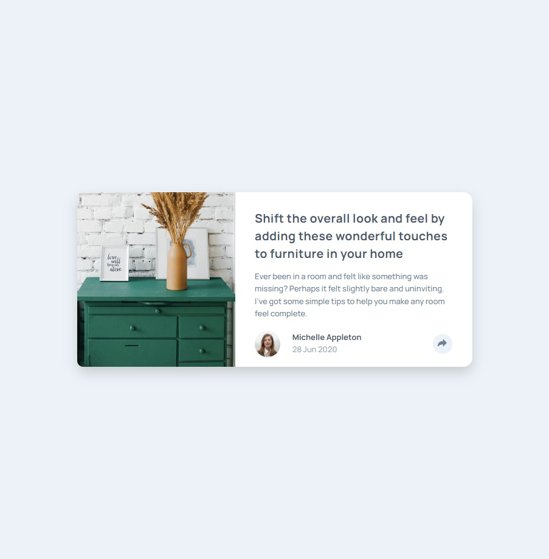

# Frontend Mentor - Article preview component solution

This is a solution to the [Article preview component challenge on Frontend Mentor](https://www.frontendmentor.io/challenges/article-preview-component-dYBN_pYFT). Frontend Mentor challenges help you improve your coding skills by building realistic projects.

## Table of contents

- [Overview](#overview)
  - [The challenge](#the-challenge)
  - [Screenshot](#screenshot)
  - [Links](#links)
- [My process](#my-process)
  - [Built with](#built-with)
  - [What I learned](#what-i-learned)
- [Author](#author)

## Overview

### The challenge

Users should be able to:

- View the optimal layout for the component depending on their device's screen size
- See the social media share links when they click the share icon

### Screenshot

### Links

- [Solution Repository](https://github.com/kemenyfa-szu/frontendmentor-013-article-preview)
- [Live Site](https://kemenyfa-szu.github.io/frontendmentor-013-article-preview/)

## My process

### Built with

- Semantic HTML5 markup
- CSS custom properties
- Flexbox
- Mobile-first workflow

### What I learned

- I struggled a lot with hiding/showing the social media buttons bubble, because I just didn't feel it right to only show it when it is clicked. But I hope I nailed it.
- I learned new JavaScript methods, such as SetTimeOut, ClearTimeout

### Continued development

## Author

- Frontend Mentor - [@kemenyfa-szu](https://www.frontendmentor.io/profile/kemenyfa-szu)
